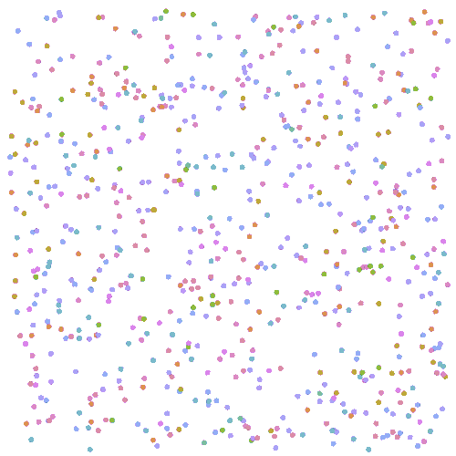

> Note: **graspologic-js** layout engine is compatible only with browsers which support SharedArrayBuffer.

In this example, we'll show how you can apply a ForceAtlas2 layout to your graph.

First off, we need to get a reference to the graph renderer, see [Dynamic Graph Example](/src-examples-intermediate-dynamic-graph#Getting_a_renderer_reference) for an example on how to a reference.

```js edit=true previewHeight=500
import { LayoutWorkerManager } from '@graspologic/layout-core'
import { utils, exampleData } from 'docs'
import { enablePanZoomEvents } from '@graspologic/renderer'

export default () => {
	// Get your reference to your renderer
	const renderer = utils.createRenderer(
		500,
		500,
		exampleData.mediumGraph({ randomize: true }),
		{
			drawEdges: false,
			autoBind: false,
			colorize: true,
		},
	)

	enablePanZoomEvents(renderer)

	// This is a url to the `@graspologic/layout-fa2/dist/fa2_worker.js` script
	const fa2Url = utils.getLayoutUrl('fa2')

	// Construct the layout manager which manages the layout worker scripts
	const layoutManager = new LayoutWorkerManager(() => new Worker(fa2Url))

	// A layout tick was performed
	layoutManager.on('progress', () => {
		// As the layout progresses, tell the graph renderer to rebind to the underlying data
		renderer.rebind()

		// Tell the renderer to re-fit to the graph
		renderer.zoomToGraph()
	})

	// Configure the layout algorithm
	layoutManager.configure({
		scalingRatio: 1000,
		slowDown: 100.8,
		targetIterations: 500,
	})

	layoutManager.layout(renderer.graph)

	return renderer.view
}
```

## Output


