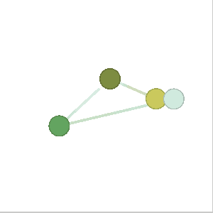

Some of the properties of nodes and edges can be animated such as their position and colors.

First off, we need to get a reference to the graph renderer, see [Dynamic Graph Example](/src-examples-intermediate-dynamic-graph#Getting_a_renderer_reference) for an example on how to retrieve a reference.

Once you have a reference to the graph renderer, you can then animate the nodes and edges contained in the renderer.

```js edit=true previewHeight=200
import { CameraAdjustmentMode } from '@graspologic/renderer'
import { utils, exampleData } from 'docs'

/**
 * Randomizes all of the nodes positions in the renderer, and updates the edges to match
 * @param renderer The renderer to update
 * @param animationLength How long the animation should take
 */
function randomizeNodePositions(renderer, animationLength = 1000) {
	// Create a map for the nodes, so we can look them up when
	// we're adjusting the edge positions
	const nodeMap = new Map()

	// Go through all the nodes in the renderer, and add them to our map
	for (const node of renderer.scene.nodes()) {
		// Store it for our edges
		nodeMap.set(node.id, node)

		// Animate the node from it's old position to this one
		node.animatePosition(
			[Math.random() * 1.5 - 0.75, Math.random() * 1.5 - 0.75, 0],
			animationLength,
		)

		// Animate the node from it's old color to this new one
		node.animateColor(utils.randomColor(), animationLength)
	}

	// Update the edges to match the nodes positions
	for (const edge of renderer.scene.edges()) {
		const sourceNode = nodeMap.get(edge.source)
		const targetNode = nodeMap.get(edge.target)

		// Animate the source position of the edge to match the new position of the source node
		edge.animateSourcePosition(sourceNode.position, animationLength)

		// Animate the target position of the edge to match the new position of the target node
		edge.animateTargetPosition(targetNode.position, animationLength)

		// Update the colors to match the source & target nodes
		edge.color = sourceNode.color
		edge.color2 = targetNode.color
	}
}

export default () => {
	// Use your renderer reference
	const renderer = utils.createRenderer(
		200,
		200,
		exampleData.smallGraph({ nodeSize: 0.1 }),
		{
			// For this example, lets make sure the renderer doesn't update the camera
			cameraAdjustmentMode: CameraAdjustmentMode.None,
		},
	)

	// How long do we want the nodes to animate
	const animationLength = 1000

	const randomizeLoop = () => {
		// Randomizes all of the nodes/edges in the renderer
		randomizeNodePositions(renderer, animationLength)

		// loop to randomly change the positions again
		setTimeout(randomizeLoop, animationLength)
	}

	// Start the randomize loop
	randomizeLoop()

	// Return the view so we can render it in the docs
	return renderer.view
}
```

## Output


