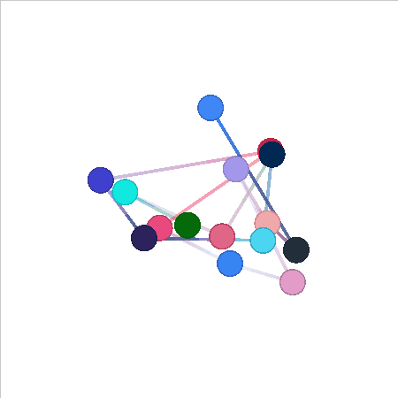

Nodes and Edges can be dynamically added/removed from the graph renderer.

## Getting a renderer reference

First off, we need to get a reference to the graph renderer that we are dynamically changing the graph for.

### React

```js previewHeight=0
import React, { useState, useEffect } from 'react'
import { GraphView } from '@graspologic/react'

export default () => {
	const [renderer, setRenderer] = useState(null)
	useEffect(() => {
		if (renderer) {
			// We have our renderer reference here
		}
	}, [renderer])
	return <GraphView ref={setRenderer} data={null}></GraphView>
}
```

### Standalone

If you're using the standalone version, you should already have a reference to the graph renderer.

## Changing the graph

Once you have a reference to a graph renderer, you can dynamically change the graph contained in the renderer.

```js edit=true previewHeight=200
import { CameraAdjustmentMode } from '@graspologic/renderer'
import { NodeImpl, EdgeImpl } from '@graspologic/graph'
import { utils } from 'docs'

/**
 * Randomizes the nodes contained in the graph
 * @param renderer The renderer to update
 */
function randomizeGraph(renderer, nodeCount) {
	// Remove all the existing nodes/edges
	renderer.scene.clear()

	const nodes = []
	for (let i = 0; i < nodeCount; i++) {
		const node = new NodeImpl()
		node.x = Math.random() * 1.5 - 0.75
		node.y = Math.random() * 1.5 - 0.75
		node.z = Math.random() * 1.5 - 0.75
		node.color = utils.randomColor()
		node.radius = 0.1
		nodes.push(node)
	}
	renderer.graph.add(nodes)

	const edges = []
	// Create an edge between every node
	for (let i = 1; i < nodeCount; i++) {
		const edge = new EdgeImpl()
		const sourceNode = nodes[i - 1]
		const targetNode = nodes[i]

		edge.color = sourceNode.color
		edge.color2 = targetNode.color

		edge.sourcePosition = [sourceNode.x, sourceNode.y, sourceNode.z]
		edge.targetPosition = [targetNode.x, targetNode.y, targetNode.z]

		edge.weight = 1

		edges.push(edge)
	}

	renderer.graph.add(edges)
}
export default () => {
	// Use your renderer reference
	const renderer = utils.createRenderer(200, 200, undefined, {
		// For this example, lets make sure the renderer doesn't update the camera
		cameraAdjustmentMode: CameraAdjustmentMode.None,
	})

	// How long do we want the nodes to animate
	const animationLength = 1000

	const randomizeLoop = () => {
		// Create a random amount of nodes
		const nodeCount = Math.floor(Math.random() * 19) + 1

		// Randomizes all of the nodes/edges in the renderer
		randomizeGraph(renderer, nodeCount)

		// loop to randomly change the positions again
		setTimeout(randomizeLoop, animationLength)
	}

	// Start the randomize loop
	randomizeLoop()

	// Return the view so we can render it in the docs
	return renderer.view
}
```

## Output


